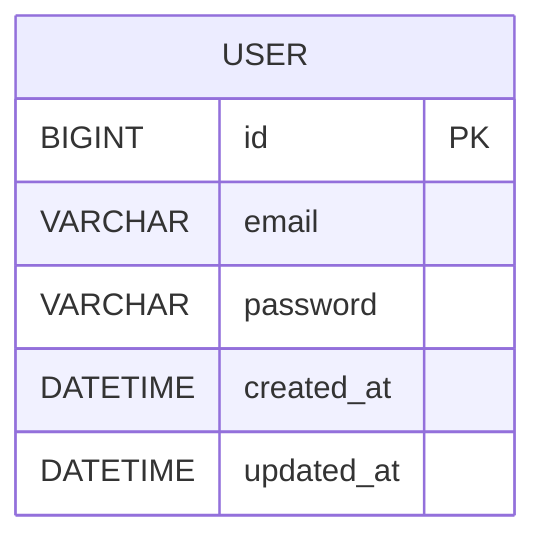

# Auth Server

간단한 로그인 및 세션 관리 서버 프로젝트  
(Spring Boot + JWT + JPA + MySQL)

---

## 실행 방법

### 1. 사전 준비
- JDK 11 이상
- Gradle 8.x
- MySQL 8.x

### 2. DB 생성
```sql
CREATE DATABASE authdb CHARACTER SET utf8mb4 COLLATE utf8mb4_unicode_ci;
```

### 3. 애플리케이션 실행
```
./gradlew bootRun
```

### 4. API 명세
- Swagger UI: [http://localhost:8080/swagger-ui.html](http://localhost:8080/swagger-ui.html)
- OpenAPI Docs: [http://localhost:8080/v3/api-docs](http://localhost:8080/v3/api-docs)

### 5. ERD 다이어그램


#### 설명
- **USER 테이블**
    - id (PK, Auto Increment)
    - email (Unique, 로그인 식별자)
    - password (BCrypt 해시 저장)
    - created_at / updated_at (생성일, 수정일)

  
#### Redis Key 설계

- Refresh Token 저장소:  
  - Key Prefix: `refresh:{userId}`  
  - Value: Refresh Token 문자열 (JWT)  
  - TTL: 7일
