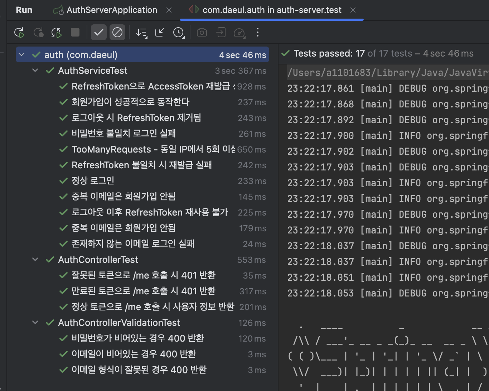

# Auth Server

간단한 로그인 및 세션 관리 서버 프로젝트  
(Spring Boot + JWT + JPA + MySQL)

---

## 실행 방법

### 1. 사전 준비
- JDK 11 이상
- Gradle 8.x
- MySQL 8.x

### 2. DB 생성
```sql
CREATE DATABASE authdb CHARACTER SET utf8mb4 COLLATE utf8mb4_unicode_ci;
```

### 3. 애플리케이션 실행
```
./gradlew bootRun
```

### 4. API 명세
- Swagger UI: [http://localhost:8080/swagger-ui.html](http://localhost:8080/swagger-ui.html)
- OpenAPI Docs: [http://localhost:8080/v3/api-docs](http://localhost:8080/v3/api-docs)

### 5. ERD 다이어그램


#### 설명
- **USER 테이블**
    - id (PK, Auto Increment)
    - email (Unique, 로그인 식별자)
    - password (BCrypt 해시 저장)
    - created_at / updated_at (생성일, 수정일)

  
#### Redis Key 설계

- Refresh Token 저장소:  
  - Key Prefix: `refresh:{userId}`  
  - Value: Refresh Token 문자열 (JWT)  
  - TTL: 7일

### 6. 테스트 결과

- JUnit 단위 테스트 14개 모두 성공 



### 7. 설계 의도 및 기술 선택 이유

#### 설계 의도
- 실제 서비스 환경에서도 확장할 수 있는 구조를 목표로 했습니다. 
- AccessToken 자체에 인증 정보를 포함하고 있어 서버가 별도의 세션 상태를 관리할 필요가 없으며,  
  여러 서버나 마이크로서비스 환경에서도 인증 검증이 단순해지기 때문입니다.  
  RefreshToken만 Redis에서 관리하여 만료나 로그아웃 처리를 수행했습니다.
- 인증 처리는 Spring Security 필터에서 수행하고, 컨트롤러는 비즈니스 로직에만 집중하도록 분리했습니다.
- 로그인, 로그아웃, 재발급 등 핵심 기능에 대한 단위 테스트를 작성해 안정성을 검증했습니다.

#### 기술 선택 이유
- **Spring Boot**: 설정이 단순하고 실행이 빨라 과제 개발 환경을 빠르게 구성할 수 있었습니다.
- **Spring Security**: 필터 기반 구조라 JWT 인증 로직을 자연스럽게 통합할 수 있었고, 추후 확장성도 높습니다.
- **JWT**: 세션 저장소 없이 인증 상태를 유지할 수 있어 stateless하게 만들 수 있었습니다.
- **Redis**: RefreshToken을 캐시 형태로 관리하기에 적합했고, TTL 기능으로 만료 처리를 쉽게 구현할 수 있었습니다.
- **Spring Data JPA**: 복잡한 SQL 없이 엔티티 중심으로 개발이 가능해 생산성이 높았습니다.
- **JUnit / Mockito**: 주요 인증 로직과 예외 케이스를 빠르게 검증할 수 있어 테스트 작성이 편했습니다.
- **Swagger**: API 문서 자동화 편의성을 위해 사용했습니다.
